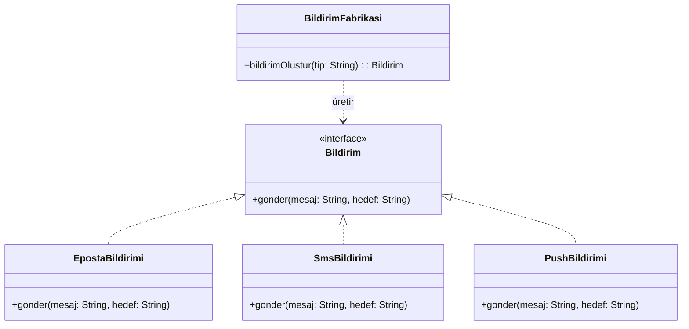
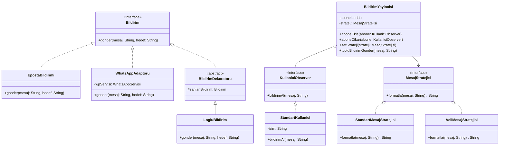

# Uygulanan Tasarım Örüntüleri

## Faz 1: Creational Pattern
**Kullanılan Örüntü:** Factory Method

**Nerede Kullanıldı?**
`src/bildirim/BildirimFabrikasi.java` sınıfında kullanıldı. Başlangıçta nesne üretimi ana yöneticinin içindeki `if-else` bloklarında yapılıyordu.

**Neden Seçildi?**
Sisteme "bana bir e-posta bildirimi ver" demek yeterli olmalıydı. Bildirimin nasıl oluşturulduğu ana sınıfın umrunda olmamalıydı.
Factory Method bu üretim sorumluluğunu ana sınıftan soyutladı.

**Ne Kazandık?**
* **Tek Sorumluluk (SRP):** Artık yöneticimiz sadece bildirim yollamayı biliyor, nesne üretmeyi değil.
* **Açık/Kapalı Prensibi (OCP):** Yeni bir bildirim türü eklemek istediğimizde ana koda dokunmayacağız.

### UML Sınıf Diyagramı (Factory Method Sonrası)

---

## Faz 2: Structural Patterns

**1. Kullanılan Örüntü:** Adapter (Adaptör)
* **Nerede Kullanıldı?** `src/adaptor/WhatsAppAdaptoru.java` sınıfında.
* **Neden Seçildi?** Dışarıdan gelen `WhatsAppServisi` sınıfındaki `sendMessage` metodu, bizim `Bildirim` arayüzündeki `gonder` metoduna uymuyordu. Kütüphane kodunu değiştiremeyeceğimiz için araya bir adaptör yazdık.

**2. Kullanılan Örüntü:** Decorator (Dekoratör)
* **Nerede Kullanıldı?** `src/dekorator/BildirimDekoratoru.java` ve `src/dekorator/LogluBildirim.java` sınıflarında.
* **Neden Seçildi?** Gönderilen tüm bildirimlere "Loglama" özelliği eklemek istiyordum. Bunu `EpostaBildirimi` veya `SmsBildirimi` içine yazsaydım mevcut kodu bozmuş (OCP ihlali) olacaktım. Decorator sayesinde bildirimleri dinamik olarak sarmalayıp, ana koda dokunmadan loglama özelliğini kazandırdık.

### Güncel UML Sınıf Diyagramı (Faz 2 Sonrası)

---

## Faz 3: Behavioral Patterns

**1. Kullanılan Örüntü:** Observer (Gözlemci)
* **Nerede Kullanıldı?** `src/observer/KullaniciObserver.java`, `src/observer/StandartKullanici.java` ve `src/observer/BildirimYayincisi.java` sınıflarında.
* **Neden Seçildi?** Sisteme dinamik olarak yeni aboneler ekleyebilmek, istendiğinde abonelikten çıkarabilmek ve sisteme bağımlı kalmadan tüm kullanıcılara tek bir merkezden yayın (broadcast) yapabilmek için en ideal örüntü Observer'dı.
* **Ne Kazandık?** Yeni bir kullanıcı tipi (örn. `PremiumKullanici`) eklemek için `BildirimYayincisi` koduna dokunmak gerekmez. `KullaniciObserver` arayüzünü uygulayan her sınıf sisteme takılabilir — **OCP** tam burada devreye giriyor.

**2. Kullanılan Örüntü:** Strategy (Strateji)
* **Nerede Kullanıldı?** `src/strateji/MesajStratejisi.java` arayüzü, `src/strateji/StandartMesajStratejisi.java` ve `src/strateji/AcilMesajStratejisi.java` sınıflarında. `BildirimYayincisi` bu stratejiyi runtime'da değiştirerek kullanıyor.
* **Neden Seçildi?** Mesajın nasıl formatlanacağına dair kararın yayıncı sınıfının içinde if-else ile verilmesini istemedim. Yarın "VIP mesaj formatı" da gerekse `BildirimYayincisi`'na dokunmadan yeni bir strateji sınıfı yazıp takabilirim.
* **Ne Kazandık?** Mesaj formatlama davranışı runtime'da değiştirilebilir hale geldi. **OCP** burada da korunuyor: `MesajStratejisi` arayüzünü implemente eden yeni bir sınıf yazmak yeterli, mevcut koda müdahale gerekmiyor.

### Final UML Sınıf Diyagramı (Tüm Proje)

