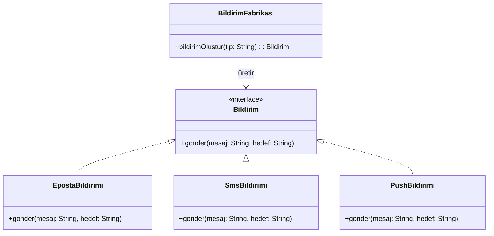
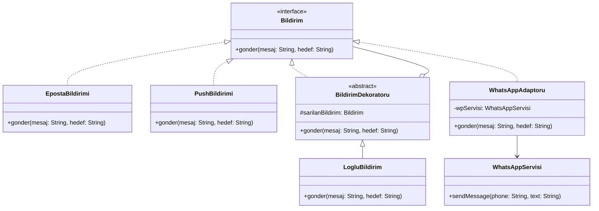

# Uygulanan Tasarım Örüntüleri

## Faz 1: Creational Pattern
**Kullanılan Örüntü:** Factory Method

**Nerede Kullanıldı?**
`src/BildirimFabrikasi.java` sınıfında kullanıldı. Başlangıçta nesne üretimi ana yöneticinin içindeki `if-else` bloklarında yapılıyordu.

**Neden Seçildi?**
Sistemin sadece "bana bir e-posta bildirimi ver" demesi gerekiyordu. Bildirimin nasıl oluşturulduğu ana sınıfın umrunda olmamalıydı. 
Factory Method bu üretim angaryasını ana sınıftan soyutladı.

**Ne Kazandık?**
* **Tek Sorumluluk (SRP):** Artık yöneticimiz sadece bildirim yollamayı biliyor, nesne üretmeyi değil.
* **Açık/Kapalı Prensibi (OCP):** Yeni bir bildirim türü eklemek istediğimizde ana koda dokunmayacağız.

### UML Sınıf Diyagramı (Factory Method Sonrası)

## Faz 2: Structural Patterns

**1. Kullanılan Örüntü:** Adapter (Adaptör)
* **Nerede Kullanıldı?** `src/WhatsAppAdaptoru.java` sınıfında.
* **Neden Seçildi?** Dışarıdan gelen `WhatsAppServisi` sınıfındaki `sendMessage` metodu, bizim `Bildirim` arayüzündeki `gonder` metoduna uymuyordu. Kütüphane kodunu değiştiremeyeceğimiz için araya bir adaptör yazdık.

**2. Kullanılan Örüntü:** Decorator (Dekoratör)
* **Nerede Kullanıldı?** `src/BildirimDekoratoru.java` ve `src/LogluBildirim.java` sınıflarında.
* **Neden Seçildi?** Gönderilen tüm bildirimlere "Loglama" özelliği eklemek istiyordum. Bunu `EpostaBildirimi` veya `SmsBildirimi` içine yazsaydım mevcut kodu bozmuş (OCP ihlali) olacaktım. Decorator sayesinde bildirimleri dinamik olarak sarmalayıp, ana koda dokunmadan loglama özelliğini kazandırdık.

### Güncel UML Sınıf Diyagramı (Faz 2 Sonrası)

