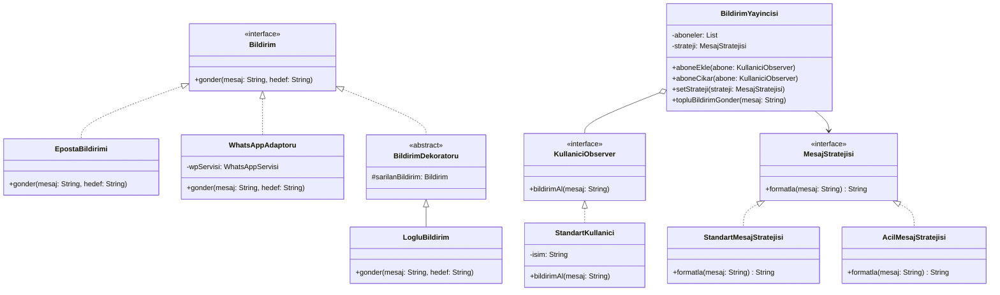

# Proje Nihai UML Sınıf Diyagramı

Sistemin tüm katmanlarını ve tasarım örüntülerinin birbirleriyle olan ilişkilerini gösteren güncel Mermaid şeması aşağıdadır:

```mermaid
classDiagram
  class Bildirim {
      <<interface>>
      +gonder(mesaj: String, hedef: String)
  }
  class EpostaBildirimi {
      +gonder(mesaj: String, hedef: String)
  }
  class WhatsAppAdaptoru {
      -wpServisi: WhatsAppServisi
      +gonder(mesaj: String, hedef: String)
  }
  class BildirimDekoratoru {
      <<abstract>>
      #sarilanBildirim: Bildirim
  }
  class LogluBildirim {
      +gonder(mesaj: String, hedef: String)
  }
  class KullaniciObserver {
      <<interface>>
      +bildirimAl(mesaj: String)
  }
  class StandartKullanici {
      -isim: String
      +bildirimAl(mesaj: String)
  }
  class BildirimYayincisi {
      -aboneler: List
      -strateji: MesajStratejisi
      +aboneEkle(abone: KullaniciObserver)
      +aboneCikar(abone: KullaniciObserver)
      +setStrateji(strateji: MesajStratejisi)
      +topluBildirimGonder(mesaj: String)
  }
  class MesajStratejisi {
      <<interface>>
      +formatla(mesaj: String) String
  }
  class StandartMesajStratejisi {
      +formatla(mesaj: String) String
  }
  class AcilMesajStratejisi {
      +formatla(mesaj: String) String
  }

  Bildirim <|.. EpostaBildirimi
  Bildirim <|.. WhatsAppAdaptoru
  Bildirim <|.. BildirimDekoratoru
  BildirimDekoratoru <|-- LogluBildirim
  KullaniciObserver <|.. StandartKullanici
  BildirimYayincisi o-- KullaniciObserver
  BildirimYayincisi --> MesajStratejisi
  MesajStratejisi <|.. StandartMesajStratejisi
  MesajStratejisi <|.. AcilMesajStratejisi
```
